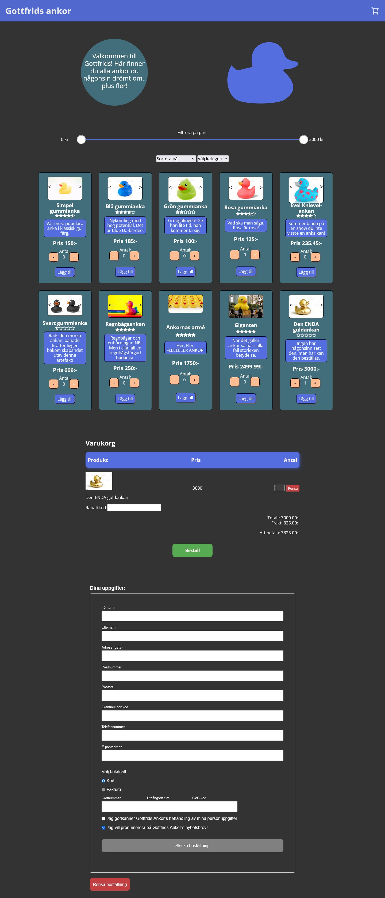
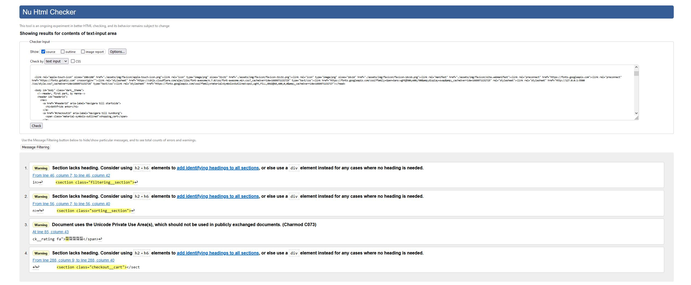
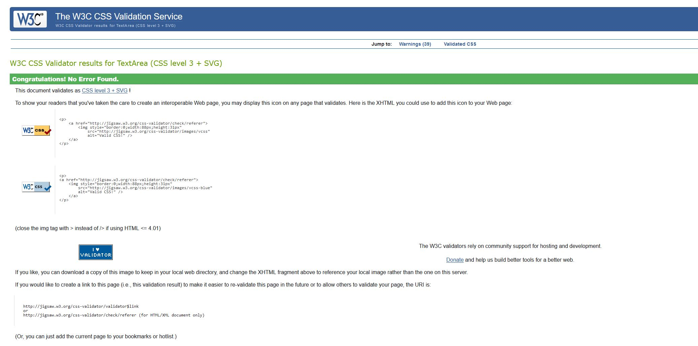

# Välkommen till [Gottfrids ankor](https://medieinstitutet.github.io/fed22d-js-grundkurs-gruppuppgift-webbshop-rubberduckgang/)!
### Skapad av: Hanna Forssell, Joel Del Pilar och David Stålgren.

### Index
* 1 Beskrivning
* 2 Teknikstack
* 3 Skärmdumpar
* 4 Valideringsrapporter
* 5 Lighthouse

#### Beskrivning:
Vi har skapat en realistisk webbshop som innehåller:
> * En **produktssida** med ett brett utbud av gummiankor i alla dess former, baserad i en "single source of truth"-array.
> * En **varukorgssammanställning** där artiklarna uppdateras i realtid, och där regler appliceras beroende på förhållanden i korgen.
> * Ett **formulär** som valideras, bland annat med regex. Beställ-knappen aktiveras ej förrän fälten är ifyllda, och varnar på ett tydligt sätt när fälten ej är korrekyt ifyllda.

#### Teknikstack:
> * Vi har använt oss utav **HTML, CSS & Javascript**
> * Vi har även implementerat **SASS**, där vi har skapat variabler, vi har nästlat kod och skapat partials.
> * Vi har använt oss utav **Prettier & ESLint** för att organisera och strukturera koden.
> * Vi har arbetat agilt med **versionshantering**.

#### Skärmdumpar
Bilderna är tagna med dark mode valt i webbläsaren. Light mode finns att tillgå.

#### Valideringsrapporter

#### Lighthouse

